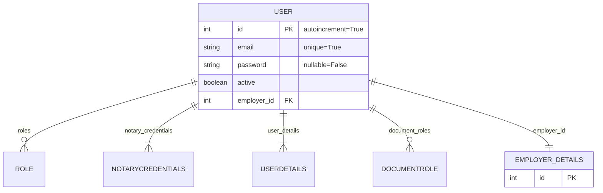
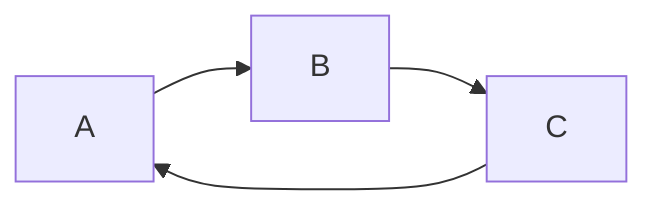

# Notarious

## Overview

My project name is `Notarious` which, as Springboard's Capstone One project, is a logbook for traditional notaries and electronic notaries (a/k/a an individual "Notary" or multiple "Notaries") to record transaction details from in-person notarial acts and services they provide to clients (a/k/a "Principals" or invidually a "Principal").  I believe this project can be extended to be part of a minimally viable product that will provide New York State based electronic notaries the online tools and platform to connect with clients, perform notarial acts and services in accordance with NYS law.  To learn more about the Electronic Notary commission there is more information [listed below](#walkthrough-of-how-electronic-notarization-is-performed).

## User Flow

In order to use the logbook feature the Notary must register through an onboarding process that requires providing their Notary Public commission details along which are sent via GET request and validated against an API hosted by [New York State - Open Data NY](https://data.ny.gov/). Once the user is registered and logged in they can access the `/notary_log` route which provides a form and CRUD tools to create, read, update and delete a record representing a transaction between the Notary and their client (a/k/a a "Principal").  Furthermore, the Notary is required to record the information covered in **§182.9 Recordkeeping and Reporting** from the *Notary Public License Law (January 2023)* issued by *NYS Department of State Division of Licensing Services* which is included below the form as context.  This is a placeholder for more elaborate instructions that would be expected if this were an enterprise grade application.  Once the Notary submits the form the data is saved to the database and can be viewed with other records in a `html` `table` powered by `GridJS` which allows the table to be queried by keyword search and sorted.  Next I will go into more detail behind the data models I designed to accomplish the aforementioned user flow.

### User Data Model





## Installation

Provide detailed instructions on how to install your project. For example:

1. pip install -r requirements.txt

2. There is a virtual environment already set up for this project so you need to activate it:

`source venv/bin/activate`

3. In `Flask`, the `FLASK_APP` environment variable is used to specify how to load the application which can be set to a python file, a module, or a package. In this case, it's being set to the `app.py` file which is where my `Flask` application is defined. When you execute the command `flask run`, `Flask` uses the value of `FLASK_APP` to find my application and run it. If `FLASK_APP` is not set, `Flask` won't know where the application is and won't be able to run it. So before you run the application you must run the command:

`export FLASK_APP=app.py`

4. Now you can run the application with the debugger module activated using the command:

`flask run --debugger`

### running the application:

1. There is a virtual environment already set up for this project so you need to activate it:

`source venv/bin/activate`

2. In Flask, the `FLASK_APP` environment variable is used to specify how to load your application. It can be set to a python file, a module, or a package. In this case, it's being set to the `app.py` file, which is presumably where your Flask application is defined.

When you run `flask run`, Flask uses the value of `FLASK_APP` to find your application and run it. If `FLASK_APP` is not set, Flask won't know where your application is and won't be able to run it. So before you run the application you must run the command:

`export FLASK_APP=app.py`

3. Now you can run the application:

`flask run --debugger`

### Google Cloud Services instructions:

This application uses Google Cloud Services and requires authentication via a service account key. Follow these steps to set up the authentication:

Set the `GOOGLE_APPLICATION_CREDENTIALS` environment variable to point to your service account key file. Replace `/path/to/your/service-account-file.json` with the actual path to your JSON file. You can do this in the terminal with the following command:

`export GOOGLE_APPLICATION_CREDENTIALS="/path/to/your/service-account-file.json"`

### psql and the database:

1. Since this is a Unix-based system you must activate the PostgreSQL service with the command:
   NB--> be prepared to enter your `psql` password

`sudo service postgresql start`

2. To log in to your PSQL account you must use the `psql` command with the `-U` option followed by your username:

`psql -U your_username`

3. Helpful "general" `psql` commands:

- `\l` : list all your databases.
- `\c nysdos_notaries_test` : Connect to a specific database.
- `\dt` : List all tables in the current database.
- `\d` : table_name: Show the structure of a specific table.
- `\du` : List all users.
- `\h` : Get a help on syntax of SQL commands.
- `\?` : Lists all psql slash commands.
- `\q` : Quit psql.

4. Helpful `psql` commands to run once you are connected to a database:

- `\dt`: List all tables in the current database.
- `\d table_name` : Show the structure of a specific table. Replace table_name with the name of the table you want to inspect.
- `\dn` : List all schemas in the current database.
- `\df` : List all functions in the current database.
- `dv` : List all views in the current database.
- `\x` : Toggle expanded display. This can make the output of some commands easier to read.
- `\a` : Toggle between unaligned and aligned output mode.
- `\timing` : Toggle timing of commands. When on, psql will show how long each command takes to execute.
- `\i filename` : Execute commands from a file. Replace filename with the name of the file you want to execute commands from.
- `\o filename` : Send all query results to a file. Replace filename with the name of the file you want to send results to.
- `\q` : Quit psql.

### my public credentials

ARTHUR John HAUSER
01HA0018990
Kings
Electronic
12/21/2023
12/21/2027


### Walkthrough of how electronic notarization is performed:
> #### How is electronic notarization performed?
>Electronic notarization is done by a registered electronic notary using commercially available software that complies with Department of State regulations.  To provide an electronic notarization, the notary public must be physically located within the State of New York at the time of the notarization.  The notary must identify the remote signer (also known as the “principal”) of the document through any of the following three methods:
>1. the notary’s personal knowledge of the signer;
>2. by means of communication technology that facilitates remote presentation by the signer of an official, acceptable form of ID, credential analysis, and identity proofing; or
>3. through oath or affirmation of a witness who personally knows the signer, and who is either personally known to the notary or identified by the previously referenced means of communication technology.
>
>Commercial software is available to notaries public to perform identify proofing and credential analysis.
>
>Regardless of the method used to confirm the identity of the signer, for electronic notarizations where the document signer appears remotely, the notary must be able to see and interact, in real-time, with the remote signer of the document through audio-visual communication technology.  Regardless of the location of the signer, this technology must have security protocols in place to prevent unauthorized access.  The notary must make and keep an audio-visual recording of the electronic notarization and ensure that there is a back-up of the recording. This recording must be kept for a minimum of 10 years.
>
>After the signer has executed the document, it must be transmitted to the notary public for officiating.  This is done by presentation to the notary of the executed document through the software platform. The notary must confirm that the document is the same as the one signed electronically in the notary public’s presence before applying the notary stamp and signature to the document.  For electronic notarial acts performed remotely, the following statement must be added to the jurat “This electronic notarial act involved a remote online appearance involving the use of communication technology.”
>
>The electronic notarial process does not require transmission of paper records or ink signatures of either the signer (i.e., principal) or electronic notary.  The result of the process is an electronically created, electronically stored document that may be done online, and may be papered out for recording or other purposes.

Source: [NYSDOS - faq](https://dos.ny.gov/notary-public-frequently-asked-questions)

### Additional Background on the Electronic Notary Commission:

- [The Future Is Here: New York Approves Remote Online Notarization by Michael A. Markowitz](https://nysba.org/the-future-is-here-new-york-approves-remote-online-notarization/)
- [New York State Department of State website](https://dos.ny.gov/notary-public)
  - [Frequently Asked Questions](https://dos.ny.gov/notary-public-frequently-asked-questions)
  - [Notary Public License Law](https://dos.ny.gov/system/files/documents/2024/05/notary.pdf)
  
### Additional Legal Standards and Requirements

- [National Institute of Standards and Technology (NIST) - Identity and Access Management Projects](https://www.nist.gov/identity-access-management/identity-and-access-management-projects)
  - [NIST Special Publication 800-63-3 - Digital Identity Guidelines](https://nvlpubs.nist.gov/nistpubs/SpecialPublications/NIST.SP.800-63-3.pdf)


## reminders on how to work on this project:

last commit includes broken code related to the error below:

Google Cloud Services is too complicated to set up at this time but the `/mydocuments` route I was working with is below followed by the error.

```
@app.route("/mydocuments", methods=["GET", "POST"])
@roles_accepted("Admin", "Principal", "Traditional Notary", "Electronic Notary")
def mydocuments():
    form = UploadDocumentForm()
    if form.validate_on_submit():
        f = form.document.data
        filename = secure_filename(f.filename)

        # Create a Cloud Storage client.
        gcs = storage.Client.from_service_account_json(
            app.config["GOOGLE_APPLICATION_CREDENTIALS"]
        )

        # Get the bucket that the file will be uploaded to.
        bucket = gcs.get_bucket(current_app.config["NOTARIOUS_TEST_BUCKET"])

        # Create a new blob and upload the file's content.
        blob = bucket.blob(filename)
        blob.upload_from_string(f.read(), content_type=f.content_type)

        # Make the blob publicly viewable.
        blob.make_public()

        # The URL can be used to directly access the uploaded file.
        file_url = blob.public_url
        # Create a new PDFDocument object
        document = PDFDocument(
            filename=filename,
            file_url=file_url,
            user_id=current_user.id,
            size=blob.size,
            content_type=f.content_type,
        )

        # Get the document role
        document_role_name = form.document_role.data
        document_role = DocumentRole.query.filter_by(name=document_role_name).first()

        # Add the document role to the document
        document.document_roles.append(document_role)

        # Add the document to the session and commit
        db.session.add(document)
        db.session.commit()

        return redirect(url_for("mydocuments"))
    return render_template("mydocuments.html", form=form)
```

error:

```
127.0.0.1 - - [04/Jun/2024 19:24:23] "POST /mydocuments HTTP/1.1" 500 -
Traceback (most recent call last):
  File "/home/haus/springboard_bootcamp_dec_2023/flask-rbac-tutorial/venv/lib/python3.10/site-packages/flask/app.py", line 2552, in __call__
    return self.wsgi_app(environ, start_response)
  File "/home/haus/springboard_bootcamp_dec_2023/flask-rbac-tutorial/venv/lib/python3.10/site-packages/flask/app.py", line 2532, in wsgi_app
    response = self.handle_exception(e)
  File "/home/haus/springboard_bootcamp_dec_2023/flask-rbac-tutorial/venv/lib/python3.10/site-packages/flask/app.py", line 2529, in wsgi_app
    response = self.full_dispatch_request()
  File "/home/haus/springboard_bootcamp_dec_2023/flask-rbac-tutorial/venv/lib/python3.10/site-packages/flask/app.py", line 1825, in full_dispatch_request
    rv = self.handle_user_exception(e)
  File "/home/haus/springboard_bootcamp_dec_2023/flask-rbac-tutorial/venv/lib/python3.10/site-packages/flask/app.py", line 1823, in full_dispatch_request
    rv = self.dispatch_request()
  File "/home/haus/springboard_bootcamp_dec_2023/flask-rbac-tutorial/venv/lib/python3.10/site-packages/flask/app.py", line 1799, in dispatch_request
    return self.ensure_sync(self.view_functions[rule.endpoint])(**view_args)
  File "/home/haus/springboard_bootcamp_dec_2023/flask-rbac-tutorial/venv/lib/python3.10/site-packages/flask_security/decorators.py", line 216, in decorated_view
    return fn(*args, **kwargs)
  File "/home/haus/springboard_bootcamp_dec_2023/flask-rbac-tutorial/app.py", line 695, in mydocuments
    bucket = gcs.get_bucket(current_app.config["NOTARIOUS_TEST_BUCKET"])
  File "/home/haus/springboard_bootcamp_dec_2023/flask-rbac-tutorial/venv/lib/python3.10/site-packages/google/cloud/storage/client.py", line 857, in get_bucket
    bucket.reload(
  File "/home/haus/springboard_bootcamp_dec_2023/flask-rbac-tutorial/venv/lib/python3.10/site-packages/google/cloud/storage/bucket.py", line 1083, in reload
    super(Bucket, self).reload(
  File "/home/haus/springboard_bootcamp_dec_2023/flask-rbac-tutorial/venv/lib/python3.10/site-packages/google/cloud/storage/_helpers.py", line 300, in reload
    api_response = client._get_resource(
  File "/home/haus/springboard_bootcamp_dec_2023/flask-rbac-tutorial/venv/lib/python3.10/site-packages/google/cloud/storage/client.py", line 462, in _get_resource
    return self._connection.api_request(
  File "/home/haus/springboard_bootcamp_dec_2023/flask-rbac-tutorial/venv/lib/python3.10/site-packages/google/cloud/storage/_http.py", line 78, in api_request
    return call()
  File "/home/haus/springboard_bootcamp_dec_2023/flask-rbac-tutorial/venv/lib/python3.10/site-packages/google/api_core/retry/retry_unary.py", line 293, in retry_wrapped_func
    return retry_target(
  File "/home/haus/springboard_bootcamp_dec_2023/flask-rbac-tutorial/venv/lib/python3.10/site-packages/google/api_core/retry/retry_unary.py", line 153, in retry_target
    _retry_error_helper(
  File "/home/haus/springboard_bootcamp_dec_2023/flask-rbac-tutorial/venv/lib/python3.10/site-packages/google/api_core/retry/retry_base.py", line 212, in _retry_error_helper
    raise final_exc from source_exc
  File "/home/haus/springboard_bootcamp_dec_2023/flask-rbac-tutorial/venv/lib/python3.10/site-packages/google/api_core/retry/retry_unary.py", line 144, in retry_target
    result = target()
  File "/home/haus/springboard_bootcamp_dec_2023/flask-rbac-tutorial/venv/lib/python3.10/site-packages/google/cloud/_http/__init__.py", line 482, in api_request
    response = self._make_request(
  File "/home/haus/springboard_bootcamp_dec_2023/flask-rbac-tutorial/venv/lib/python3.10/site-packages/google/cloud/_http/__init__.py", line 341, in _make_request
    return self._do_request(
  File "/home/haus/springboard_bootcamp_dec_2023/flask-rbac-tutorial/venv/lib/python3.10/site-packages/google/cloud/_http/__init__.py", line 379, in _do_request
    return self.http.request(
  File "/home/haus/springboard_bootcamp_dec_2023/flask-rbac-tutorial/venv/lib/python3.10/site-packages/google/auth/transport/requests.py", line 537, in request
    self.credentials.before_request(auth_request, method, url, request_headers)
  File "/home/haus/springboard_bootcamp_dec_2023/flask-rbac-tutorial/venv/lib/python3.10/site-packages/google/auth/credentials.py", line 230, in before_request
    self._blocking_refresh(request)
  File "/home/haus/springboard_bootcamp_dec_2023/flask-rbac-tutorial/venv/lib/python3.10/site-packages/google/auth/credentials.py", line 193, in _blocking_refresh
    self.refresh(request)
  File "/home/haus/springboard_bootcamp_dec_2023/flask-rbac-tutorial/venv/lib/python3.10/site-packages/google/oauth2/service_account.py", line 445, in refresh
    access_token, expiry, _ = _client.jwt_grant(
  File "/home/haus/springboard_bootcamp_dec_2023/flask-rbac-tutorial/venv/lib/python3.10/site-packages/google/oauth2/_client.py", line 308, in jwt_grant
    response_data = _token_endpoint_request(
  File "/home/haus/springboard_bootcamp_dec_2023/flask-rbac-tutorial/venv/lib/python3.10/site-packages/google/oauth2/_client.py", line 279, in _token_endpoint_request
    _handle_error_response(response_data, retryable_error)
  File "/home/haus/springboard_bootcamp_dec_2023/flask-rbac-tutorial/venv/lib/python3.10/site-packages/google/oauth2/_client.py", line 72, in _handle_error_response
    raise exceptions.RefreshError(
google.auth.exceptions.RefreshError: ('invalid_grant: Invalid JWT: Token must be a short-lived token (60 minutes) and in a reasonable timeframe. Check your iat and exp values in the JWT claim.', {'error': 'invalid_grant', 'error_description': 'Invalid JWT: Token must be a short-lived token (60 minutes) and in a reasonable timeframe. Check your iat and exp values in the JWT claim.'})
```

Start next session to debug using the following instructions:

The error message indicates that the JWT (JSON Web Token) used for authentication with Google Cloud Storage is invalid. The error message suggests that the token must be a short-lived token (60 minutes) and in a reasonable timeframe.

This error can occur if the system clock on your machine is not synchronized with the correct time. The JWT includes an issued at time (iat) and an expiration time (exp), and if your system clock is too far ahead or behind, the token may be considered invalid.

Here are a few steps to fix this issue:

1. Check your system clock and ensure it's correct. If it's not, correct it.

2. If you're using a service account for authentication, make sure the service account has the necessary permissions to access the bucket.

3. If you're generating the JWT yourself, ensure that the iat (issued at) and exp (expiration) claims are set correctly. The exp claim should be a timestamp in the future, but not more than 60 minutes from the iat claim.

4. If you're using a library to authenticate, it may be handling the JWT generation for you. In this case, updating the library to the latest version may help.

5. If none of the above steps work, you may need to create a new service account and use it for authentication.

### debug notes continued 6/7//24:

```
The error message indicates that the JWT token used for authentication is invalid because it's not a short-lived token (60 minutes) and/or it's not in a reasonable timeframe. This could be due to the iat (issued at) and exp (expiration) values in the JWT claim.

Given that you've already checked your system clock and it's correct, the issue might be with how the JWT token is being generated or used in your application. Here are a few things you can check:

1. Token Generation: Ensure that the JWT token is being generated correctly, with the iat set to the current time and the exp set to 60 minutes from the current time.

2. Token Usage: Ensure that the token is being used immediately after being generated and not being stored or reused. JWT tokens are meant to be used once and then discarded.

3. Service Account Key: Ensure that the service account key file used to authenticate your application is correct and up-to-date. If you're not sure, you can create a new service account key file in the Google Cloud Console and update your application to use the new key file.

4. Library Versions: Ensure that you're using the latest versions of the Google Cloud client libraries. Sometimes, these kinds of issues can be caused by bugs in older versions of the libraries.

If none of these suggestions solve the issue, you might want to reach out to Google Cloud Support or the community support forums for more help.
```

## Debugging notes from issue with `Flask` `session` and `Flask_Security`'s `SQLAlchemySessionUserDatastore` and `SQLAlchemyUserDatastore`

1. Flask's `session` object: This is a way to store information specific to a user from one request to the next. It's a dictionary-like object that uses a signed cookie to keep the session secure. In your code, you're using the session to store the email, password, and role_id of a user during the signup process. This data is then available to you in subsequent requests, even if they happen in a different route, like `/notaryauth`.

2. `SQLAlchemySessionUserDatastore` and `SQLAlchemyUserDatastore`: These are classes provided by Flask-Security that allow you to interact with your User and Role models. They provide methods for creating users, finding users, adding roles to users, etc. In your code, you're using `SQLAlchemySessionUserDatastore` to create an instance of `user_datastore` at the start of your application. This `user_datastore` is then used in your `/signup` and `/notaryauth` routes to create users and add roles to them.

The `SQLAlchemySessionUserDatastore` is designed to work with SQLAlchemy's session-based transactions, which means it doesn't commit changes to the database immediately. Instead, it waits until you call `db.session.commit()`. This can be useful if you want to make multiple changes and then commit them all at once.

On the other hand, `SQLAlchemyUserDatastore` commits changes immediately. In your `/notaryauth` route, you're creating a new instance of `SQLAlchemyUserDatastore` and using it to create a user and add a role to them. These changes are committed to the database as soon as you call the methods.

In terms of how these are impacting your code, the Flask `session` is allowing you to store user data across requests, while the `SQLAlchemyUserDatastore` is letting you interact with your User and Role models. However, it's unusual to use both `SQLAlchemySessionUserDatastore` and `SQLAlchemyUserDatastore` in the same application. Typically, you would choose one or the other based on whether you want to use session-based transactions or not.

### user_datastore variable explained in depth:

`user_datastore = SQLAlchemySessionUserDatastore(db.session, User, Role)`

This code creates an instance of the `SQLAlchemySessionUserDatastore` class, which is a part of the `Flask-Security` extension. This class is a datastore adapter that allows `Flask-Security` to interact with your `User` and `Role` models using `SQLAlchemy`'s session-based transactions.

Here's a breakdown of the parameters:

- `db.session`: This is the `SQLAlchemy` `session` that will be used to interact with the database. `SQLAlchemy` `session`s manage all the interactions with the database and keep track of all the objects you've loaded or associated with it. They also begin and control transactions.

- `User`: This is your `User` model class. It should be a `SQLAlchemy` model that includes certain fields required by `Flask-Security`, such as a password and email.

- `Role`: This is your `Role` model class. It should be a `SQLAlchemy` model that represents roles that users can have.

The `SQLAlchemySessionUserDatastore` instance (`user_datastore`) can then be used to create users, roles, and to add roles to users, among other things. It's designed to work with SQLAlchemy's session-based transactions, which means it **doesn't commit changes to the database immediately**. Instead, it waits until you call `db.session.commit()`. This can be useful if you want to make multiple changes and then commit them all at once.

---

### Flask_Security explained

`security = Security(app, user_datastore)`

This code initializes the `Flask-Security` extension with your `Flask` application (`app`) and the `SQLAlchemy` session-based datastore (`user_datastore`).

Here's a breakdown of the parameters:

- `app`: This is your `Flask` application instance. `Flask-Security` needs this to set up routes, templates, and other configuration options.

- `user_datastore`: This is an instance of `SQLAlchemySessionUserDatastore` that you've created. It's used by `Flask-Security` to interact with your `User` and `Role` models.

The `Security` class is a part of the `Flask-Security` extension. It provides a number of features for security-related aspects of your application, such as **user authentication**, **role management**, **password hashing**, and **session management**.

By creating an instance of the `Security` class and passing in your `Flask` application and datastore, you're setting up `Flask-Security` to handle these aspects of your application. This includes setting up routes for user registration, login, logout, and more. It also includes setting up the necessary views and templates for these routes.

When you initialize `Flask-Security` by creating an instance of the Security class, you're essentially telling `Flask-Security` to set up a number of routes, views, and templates that are commonly used in web applications for user management. These include routes for user registration, login, logout, and more.

For example, `Flask-Security` will automatically create the following routes:

- `/login`: This route is used for user login. It will display a login form to the user and handle the submission of this form to authenticate the user.

- `/logout`: This route is used to log out the user. It will clear the user's session and redirect them to the login page.

- `/register`: This route is used for user registration. It will display a registration form to the user and handle the submission of this form to create a new user.

- `/reset`: This route is used to reset a user's password. It will display a form to the user where they can enter their email address. `Flask-Security` will then send them an email with a link to reset their password.

In addition to these routes, `Flask-Security` will also set up the necessary views and templates. The views are the functions that handle the requests to these routes, and the templates are the HTML files that define what the user sees when they visit these routes.

For example, for the `/login` route, `Flask-Security` will create a view function that handles the GET and POST requests to this route. It will also create a `login.html` template that defines the login form that the user sees.

All of this setup is done automatically when you create an instance of the `Security` class and pass in your Flask application and datastore. This saves you the time and effort of having to create these routes, views, and templates yourself.

### notes from call with Mike @ Springboard

https://jsdoc.app/tags-example
https://docs.oracle.com/javase/8/docs/api/
https://docs.python.org/3/library/pydoc.html
https://medium.com/@peterkong/comparison-of-python-documentation-generators-660203ca3804

use this documentation guide to create basic documentation for the project.
https://www.sphinx-doc.org/en/master/usage/quickstart.html
