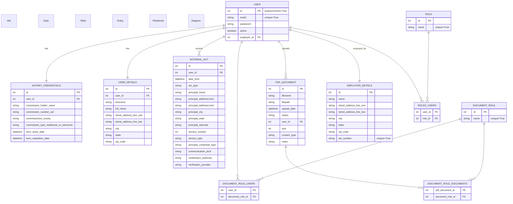

# Notarious - Table of Contents

- [Notarious - Table of Contents](#notarious---table-of-contents)
  - [Project Overview](#project-overview)
      - [I. User Flow](#i-user-flow)
      - [II. Initial Signup](#ii-initial-signup)
      - [III. User Details](#iii-user-details)
      - [IV. Signup for Notaries](#iv-signup-for-notaries)
      - [V. RBAC for Notaries](#v-rbac-for-notaries)
      - [VI. Signup for Administrators](#vi-signup-for-administrators)
    - [User Flow Onboarding Sequence Diagram](#user-flow-onboarding-sequence-diagram)
    - [Data Model ERD](#data-model-erd)
  - [How to use this application](#how-to-use-this-application)
    - [Installation](#installation)
    - [running the application:](#running-the-application)
    - [Google Cloud Services instructions:](#google-cloud-services-instructions)
    - [psql and the database:](#psql-and-the-database)
  - [Background on Electronic Notarization](#background-on-electronic-notarization)
    - [Walkthrough of how electronic notarization is performed:](#walkthrough-of-how-electronic-notarization-is-performed)
    - [Additional Background on the Electronic Notary Commission:](#additional-background-on-the-electronic-notary-commission)
    - [Additional Legal Standards and Requirements](#additional-legal-standards-and-requirements)
  - [Helpful Debugging Notes](#helpful-debugging-notes)
    - [Debugging notes from issue with `Flask` `session` and `Flask_Security`'s `SQLAlchemySessionUserDatastore` and `SQLAlchemyUserDatastore`](#debugging-notes-from-issue-with-flask-session-and-flask_securitys-sqlalchemysessionuserdatastore-and-sqlalchemyuserdatastore)
    - [user\_datastore variable explained in depth](#user_datastore-variable-explained-in-depth)
    - [Flask\_Security explained](#flask_security-explained)

## Project Overview 

[Back to TOC](#notarious---table-of-contents)

My project name is `Notarious` which, as Springboard's Capstone One project, is a logbook for traditional notaries and electronic notaries (a/k/a an individual "Notary" or multiple "Notaries") to record transaction details from in-person notarial acts and services they provide to clients (a/k/a "Principals" or invidually a "Principal"). I believe this project can be extended to be part of a minimally viable product ("MVP") that will provide New York State based electronic notaries the online tools and platform to connect with clients, perform notarial acts and services in compliance with NYS law. Throughout this `Overview` of the Capstone Project I will refer to a feature or workflow of the MVP as the reason why I made certain design decisions for my data tables even though the feature is not complete, however, keep in mind I made sure that the Capstone One criteria is satisfied in this project. To learn more about the Electronic Notary commission and workflow there is more information [listed below](#walkthrough-of-how-electronic-notarization-is-performed).

#### I. User Flow

[Back to TOC](#notarious---table-of-contents)

Before the user can access the logbook feature the Notary must register through an onboarding process that requires providing their Notary Public commission details along which are sent via GET request and validated against an API hosted by [New York State - Open Data NY](https://data.ny.gov/). Once the user is registered and logged in they can access the `/notary_log` route which provides a form and CRUD tools to create, read, update and delete a record representing a transaction between the Notary and their client (a/k/a a "Principal"). Furthermore, the Notary is required to record the information covered in **§182.9 Recordkeeping and Reporting** from the _Notary Public License Law (January 2023)_ issued by _NYS Department of State Division of Licensing Services_ which is included below the form as context. This is a placeholder for more elaborate instructions that would be expected if this were an enterprise grade application. Once the Notary submits the form the data is saved to the database and can be viewed with other records in a `html` `table` powered by `GridJS` which allows the table to be queried by keyword search and sorted. Next I will go into more detail behind the onboarding process and how I implemented my `Flask` routes, `Jinja` templates, `WTForms` classes, `SQLAlchemy` models and other technologies.

#### II. Initial Signup

[Back to TOC](#notarious---table-of-contents)

In my application, the user onboarding process is initiated at the `/signup` route, where several key technologies work together to ensure a seamless experience:

1. **Flask Route (`/signup`)**: Directs users to the signup section, showcasing Flask's capability to handle URL routing and user requests efficiently.
2. **Jinja Template (`signup.html`)**: Demonstrates the use of Flask's Jinja templating engine to dynamically render the `SignupForm`, allowing users to input their basic data including `username`, `password` (which is securely hashed), and `role`.
3. **WTForms (`SignupForm`)**: This form class is crucial for collecting user data in a structured and secure manner, illustrating WTForms' integration with Flask for form rendering, data submission, and validation.
4. **SQLAlchemy Model (`User` table with `role` field)**: After form submission, user data is stored in the `User` table, with the `role` field added to facilitate a many-to-many relationship with a `Role` table. This table defines essential roles for the platform: "Admin", "Principal", "Traditional Notary", and "Electronic Notary", using SQLAlchemy for ORM.
5. **Role-Based Access Control**: Utilizing `flask_security`, I implemented backend logic to assign specific restrictions and access based on the user's role, enhancing security and customizing user experience based on their role selection.

This structure not only aligns with the goal of creating a notarial service platform by connecting Notaries with potential clients but also demonstrates a deep understanding of how Flask, Jinja, WTForms, SQLAlchemy, and flask_security work together to manage user data, roles, and access rights efficiently.

#### III. User Details

[Back to TOC](#notarious---table-of-contents)

In my application, the Principal role is designed for simplicity, requiring only notarial services. To enhance realism, I implemented a `/signup_user_details` route. This route serves multiple purposes:

1. **Flask Route (`/signup_user_details`)**: Directs users to a specific part of the application where they can provide personal information. Flask routes are essential for defining URLs and handling user requests.
2. **Jinja Template (`signup_user_details.html`)**: Utilizes Flask's templating engine, Jinja, to dynamically generate HTML pages. When the `/signup_user_details` route is accessed, the Jinja template renders the `UserDetailsForm`.
3. **WTForms (`UserDetailsForm`)**: This form class collects user data in a structured and secure manner. WTForms integrates seamlessly with Flask to handle form rendering, data submission, and validation.
4. **SQLAlchemy Model (`user_details` table)**: Upon form submission, the entered data is saved to the `user_details` table using SQLAlchemy, Flask's ORM of choice. This demonstrates how data persistence is managed, linking user input to database storage.

This setup ensures that all users, regardless of their role, provide essential information like full name, timezone, and address. It underscores the application's reliance on authenticity and user trust, mirroring traditional notarization's emphasis on personal information accuracy. Additionally, the `user_details` table's design is flexible, allowing for future expansions to support a Minimum Viable Product (MVP).

#### IV. Signup for Notaries

[Back to TOC](#notarious---table-of-contents)

If users select either the Traditional or Electronic Notary role they will undergo a specific process to verify their credentials:
1. **Flask Route (`/signup_notary`)**: This route is activated when a user selects either the Traditional or Electronic Notary role. Flask efficiently handles the URL routing, directing users to the appropriate part of the application for notary registration.
2. **Jinja Template (`signup_notary.html`)**: Utilizing Flask's Jinja templating engine, the `SignupNotaryForm` is dynamically rendered. This form is specifically designed to collect `notary_credentials` from users, showcasing Jinja's capability to generate interactive HTML forms based on user role selection.
3. **WTForms (`SignupNotaryForm`)**: The `SignupNotaryForm` is a WTForms class that securely collects and validates the notary credentials submitted by the user. This demonstrates WTForms' role in handling form data submission and validation within Flask applications.
4. **API Integration for Credential Verification**: The `match_notary_credentials` function sends the collected `notary_credentials` as a `GET` request to the [New York State - Open Data NY](https://data.ny.gov/) API. This step is crucial for verifying if the submitted credentials match the state's notary database, illustrating how external APIs can be integrated into Flask applications for enhanced functionality.
5. **Conditional Role Assignment**: Upon successful credential verification, users are granted the role of Traditional Notary or Electronic Notary, based on their selection and credential match. This process underscores the application's use of conditional logic and API responses to dynamically assign user roles.

Additionally, it's important to note that since commission data is public, further identity proofing and credential analysis are necessary for a Minimum Viable Product (MVP) or enterprise-level application. Services like `ID.ME` and `Stripe` could be integrated for this purpose, highlighting the application's potential for scalability and enhanced security.  In order to test that the `/signup_notary` route works you can use my Notary Public credentials below.

```
ARTHUR John HAUSER
01HA0018990
Kings
Electronic
12/21/2023
12/21/2027
```

#### V. RBAC for Notaries

The Traditional and Electronic Notary roles are mutually exclusive, each requiring specific features tailored to their commission. Notaries are prohibited from notarizing their own signatures or performing notarial acts in transactions where they have a direct financial interest, as outlined in §182.3 Requirements for Notaries(a)(5).

Key Differences:
- **Traditional Notary**: Limited to performing in-person notarial acts.
- **Electronic Notary**: Capable of performing both in-person and electronic notarial acts.

Both roles have access to a notary logbook feature. However, the Traditional Notary's logbook is designed solely for in-person acts, while the Electronic Notary's logbook includes additional fields to record both in-person and electronic acts. Currently, the logbook requires manual data entry, but plans are in place to automate this feature for electronic notarial acts in the MVP.  This structure ensures that the application adheres to legal requirements while accommodating the distinct needs of Traditional and Electronic Notaries.

#### VI. Signup for Administrators

[Back to TOC](#notarious---table-of-contents)

Furthermore, regardless of which of the three main roles they pick the user may also request the "Admin" role. This is a placeholder for a stetch-goal feature where a Notary's employer may want to assign an Admin to their Notarious account to manage the many other notaries and their transactions given the Notary's recordkeeping requirements. Furthermore, the Admin has access to all aspects of the website and the ability to view the records of all notaries associated with their mutual employer the latter of which is an unimplemented feature.
[Back to TOC](#notarious---table-of-contents)

### User Flow Onboarding Sequence Diagram

[Back to TOC](#notarious---table-of-contents)

```mermaid
sequenceDiagram
    title User Registration Sequence Diagram
    participant User
    participant /signup as /signup
    participant /signup_user_details as /signup_user_details
    participant /signup_notary as /signup_notary
    participant /signup_admin as /signup_admin
    participant /confirm_registration as /confirm_registration

    User->>+ /signup: Clicks on /signup
    /signup->>+ /signup_user_details: Redirects to /signup_user_details
    Note over /signup: Jinja: auth/signup.html<br>Form: SignupForm<br>Data: email, password, role_ids

    alt Principal Role
        /signup_user_details->>+ /confirm_registration: Redirects to /confirm_registration if Principal
        Note over /signup_user_details: Jinja: auth/signup_user_details.html<br>Form: UserDetailsForm<br>Data: full_name, address, city, state, zip, timezone
    else Traditional or Electronic Notary
        /signup_user_details->>+ /signup_notary: Redirects to /signup_notary if either Traditional or Electronic Notary
        Note over /signup_user_details: Jinja: auth/signup_user_details.html<br>Form: UserDetailsForm<br>Data: full_name, address, city, state, zip, timezone
        /signup_notary->>+ /confirm_registration: Redirects to /confirm_registration
        Note over /signup_notary: Jinja: auth/signup_notary.html<br>Form: SignupNotaryForm<br>Data: full_name, commission_id, county, start_date, end_date
    end

    alt Requested Admin Role
        /signup_user_details->>+ /signup_admin: Redirects to /signup_admin if Admin requested
        /signup_notary->>+ /signup_admin: Redirects to /signup_admin if Admin requested
        /signup_admin->>+ /confirm_registration: Redirects to /confirm_registration
        Note over /signup_admin: Jinja: auth/signup_admin.html<br>Form: SignupAdminForm<br>Data: special_code
    end

    /confirm_registration-->>- User: Finalizes registration
    Note over /confirm_registration: Jinja: auth/confirm_registration.html<br>Form: ConfirmRegistrationForm<br>Data: session data, user details, notary credentials
```

### Data Model ERD

[Back to TOC](#notarious---table-of-contents)



## How to use this application

### Installation

[Back to TOC](#notarious---table-of-contents)

Provide detailed instructions on how to install your project. For example:

1. pip install -r requirements.txt

2. There is a virtual environment already set up for this project so you need to activate it:

`source venv/bin/activate`

3. In `Flask`, the `FLASK_APP` environment variable is used to specify how to load the application which can be set to a python file, a module, or a package. In this case, it's being set to the `app.py` file which is where my `Flask` application is defined. When you execute the command `flask run`, `Flask` uses the value of `FLASK_APP` to find my application and run it. If `FLASK_APP` is not set, `Flask` won't know where the application is and won't be able to run it. So before you run the application you must run the command:

`export FLASK_APP=app.py`

4. Now you can run the application with the debugger module activated using the command:

`flask run --debugger`

### running the application:

[Back to TOC](#notarious---table-of-contents)

1. There is a virtual environment already set up for this project so you need to activate it:

`source venv/bin/activate`

2. In Flask, the `FLASK_APP` environment variable is used to specify how to load your application. It can be set to a python file, a module, or a package. In this case, it's being set to the `app.py` file, which is presumably where your Flask application is defined.

When you run `flask run`, Flask uses the value of `FLASK_APP` to find your application and run it. If `FLASK_APP` is not set, Flask won't know where your application is and won't be able to run it. So before you run the application you must run the command:

`export FLASK_APP=app.py`

3. Now you can run the application:

`flask run --debugger`

### Google Cloud Services instructions:

[Back to TOC](#notarious---table-of-contents)

This application uses Google Cloud Services and requires authentication via a service account key. Follow these steps to set up the authentication:

Set the `GOOGLE_APPLICATION_CREDENTIALS` environment variable to point to your service account key file. Replace `/path/to/your/service-account-file.json` with the actual path to your JSON file. You can do this in the terminal with the following command:

`export GOOGLE_APPLICATION_CREDENTIALS="/path/to/your/service-account-file.json"`

### psql and the database:

[Back to TOC](#notarious---table-of-contents)

1. Since this is a Unix-based system you must activate the PostgreSQL service with the command:
   NB--> be prepared to enter your `psql` password

`sudo service postgresql start`

2. To log in to your PSQL account you must use the `psql` command with the `-U` option followed by your username:

`psql -U your_username`

3. Helpful "general" `psql` commands:

- `\l` : list all your databases.
- `\c nysdos_notaries_test` : Connect to a specific database.
- `\dt` : List all tables in the current database.
- `\d` : table_name: Show the structure of a specific table.
- `\du` : List all users.
- `\h` : Get a help on syntax of SQL commands.
- `\?` : Lists all psql slash commands.
- `\q` : Quit psql.

4. Helpful `psql` commands to run once you are connected to a database:

- `\dt`: List all tables in the current database.
- `\d table_name` : Show the structure of a specific table. Replace table_name with the name of the table you want to inspect.
- `\dn` : List all schemas in the current database.
- `\df` : List all functions in the current database.
- `dv` : List all views in the current database.
- `\x` : Toggle expanded display. This can make the output of some commands easier to read.
- `\a` : Toggle between unaligned and aligned output mode.
- `\timing` : Toggle timing of commands. When on, psql will show how long each command takes to execute.
- `\i filename` : Execute commands from a file. Replace filename with the name of the file you want to execute commands from.
- `\o filename` : Send all query results to a file. Replace filename with the name of the file you want to send results to.
- `\q` : Quit psql.

## Background on Electronic Notarization

[Back to TOC](#notarious---table-of-contents)

### Walkthrough of how electronic notarization is performed:

[Back to TOC](#notarious---table-of-contents)

> #### How is electronic notarization performed?
>
> Electronic notarization is done by a registered electronic notary using commercially available software that complies with Department of State regulations. To provide an electronic notarization, the notary public must be physically located within the State of New York at the time of the notarization. The notary must identify the remote signer (also known as the “principal”) of the document through any of the following three methods:
>
> 1.  the notary’s personal knowledge of the signer;
> 2.  by means of communication technology that facilitates remote presentation by the signer of an official, acceptable form of ID, credential analysis, and identity proofing; or
> 3.  through oath or affirmation of a witness who personally knows the signer, and who is either personally known to the notary or identified by the previously referenced means of communication technology.
>
> Commercial software is available to notaries public to perform identify proofing and credential analysis.
>
> Regardless of the method used to confirm the identity of the signer, for electronic notarizations where the document signer appears remotely, the notary must be able to see and interact, in real-time, with the remote signer of the document through audio-visual communication technology. Regardless of the location of the signer, this technology must have security protocols in place to prevent unauthorized access. The notary must make and keep an audio-visual recording of the electronic notarization and ensure that there is a back-up of the recording. This recording must be kept for a minimum of 10 years.
>
> After the signer has executed the document, it must be transmitted to the notary public for officiating. This is done by presentation to the notary of the executed document through the software platform. The notary must confirm that the document is the same as the one signed electronically in the notary public’s presence before applying the notary stamp and signature to the document. For electronic notarial acts performed remotely, the following statement must be added to the jurat “This electronic notarial act involved a remote online appearance involving the use of communication technology.”
>
> The electronic notarial process does not require transmission of paper records or ink signatures of either the signer (i.e., principal) or electronic notary. The result of the process is an electronically created, electronically stored document that may be done online, and may be papered out for recording or other purposes.

Source: [NYSDOS - faq](https://dos.ny.gov/notary-public-frequently-asked-questions)

### Additional Background on the Electronic Notary Commission:

[Back to TOC](#notarious---table-of-contents)

- [The Future Is Here: New York Approves Remote Online Notarization by Michael A. Markowitz](https://nysba.org/the-future-is-here-new-york-approves-remote-online-notarization/)
- [New York State Department of State website](https://dos.ny.gov/notary-public)
  - [Frequently Asked Questions](https://dos.ny.gov/notary-public-frequently-asked-questions)
  - [Notary Public License Law](https://dos.ny.gov/system/files/documents/2024/05/notary.pdf)

### Additional Legal Standards and Requirements

[Back to TOC](#notarious---table-of-contents)

- [National Institute of Standards and Technology (NIST) - Identity and Access Management Projects](https://www.nist.gov/identity-access-management/identity-and-access-management-projects)
  - [NIST Special Publication 800-63-3 - Digital Identity Guidelines](https://nvlpubs.nist.gov/nistpubs/SpecialPublications/NIST.SP.800-63-3.pdf)

## Helpful Debugging Notes

[Back to TOC](#notarious---table-of-contents)

### Debugging notes from issue with `Flask` `session` and `Flask_Security`'s `SQLAlchemySessionUserDatastore` and `SQLAlchemyUserDatastore`

[Back to TOC](#notarious---table-of-contents)

1. Flask's `session` object: This is a way to store information specific to a user from one request to the next. It's a dictionary-like object that uses a signed cookie to keep the session secure. In your code, you're using the session to store the email, password, and role_id of a user during the signup process. This data is then available to you in subsequent requests, even if they happen in a different route, like `/notaryauth`.

2. `SQLAlchemySessionUserDatastore` and `SQLAlchemyUserDatastore`: These are classes provided by Flask-Security that allow you to interact with your User and Role models. They provide methods for creating users, finding users, adding roles to users, etc. In your code, you're using `SQLAlchemySessionUserDatastore` to create an instance of `user_datastore` at the start of your application. This `user_datastore` is then used in your `/signup` and `/notaryauth` routes to create users and add roles to them.

The `SQLAlchemySessionUserDatastore` is designed to work with SQLAlchemy's session-based transactions, which means it doesn't commit changes to the database immediately. Instead, it waits until you call `db.session.commit()`. This can be useful if you want to make multiple changes and then commit them all at once.

On the other hand, `SQLAlchemyUserDatastore` commits changes immediately. In your `/notaryauth` route, you're creating a new instance of `SQLAlchemyUserDatastore` and using it to create a user and add a role to them. These changes are committed to the database as soon as you call the methods.

In terms of how these are impacting your code, the Flask `session` is allowing you to store user data across requests, while the `SQLAlchemyUserDatastore` is letting you interact with your User and Role models. However, it's unusual to use both `SQLAlchemySessionUserDatastore` and `SQLAlchemyUserDatastore` in the same application. Typically, you would choose one or the other based on whether you want to use session-based transactions or not.

### user_datastore variable explained in depth

[Back to TOC](#notarious---table-of-contents)

`user_datastore = SQLAlchemySessionUserDatastore(db.session, User, Role)`

This code creates an instance of the `SQLAlchemySessionUserDatastore` class, which is a part of the `Flask-Security` extension. This class is a datastore adapter that allows `Flask-Security` to interact with your `User` and `Role` models using `SQLAlchemy`'s session-based transactions.

Here's a breakdown of the parameters:

- `db.session`: This is the `SQLAlchemy` `session` that will be used to interact with the database. `SQLAlchemy` `session`s manage all the interactions with the database and keep track of all the objects you've loaded or associated with it. They also begin and control transactions.

- `User`: This is your `User` model class. It should be a `SQLAlchemy` model that includes certain fields required by `Flask-Security`, such as a password and email.

- `Role`: This is your `Role` model class. It should be a `SQLAlchemy` model that represents roles that users can have.

The `SQLAlchemySessionUserDatastore` instance (`user_datastore`) can then be used to create users, roles, and to add roles to users, among other things. It's designed to work with SQLAlchemy's session-based transactions, which means it **doesn't commit changes to the database immediately**. Instead, it waits until you call `db.session.commit()`. This can be useful if you want to make multiple changes and then commit them all at once.

### Flask_Security explained

[Back to TOC](#notarious---table-of-contents)

`security = Security(app, user_datastore)`

This code initializes the `Flask-Security` extension with your `Flask` application (`app`) and the `SQLAlchemy` session-based datastore (`user_datastore`).

Here's a breakdown of the parameters:

- `app`: This is your `Flask` application instance. `Flask-Security` needs this to set up routes, templates, and other configuration options.

- `user_datastore`: This is an instance of `SQLAlchemySessionUserDatastore` that you've created. It's used by `Flask-Security` to interact with your `User` and `Role` models.

The `Security` class is a part of the `Flask-Security` extension. It provides a number of features for security-related aspects of your application, such as **user authentication**, **role management**, **password hashing**, and **session management**.

By creating an instance of the `Security` class and passing in your `Flask` application and datastore, you're setting up `Flask-Security` to handle these aspects of your application. This includes setting up routes for user registration, login, logout, and more. It also includes setting up the necessary views and templates for these routes.

When you initialize `Flask-Security` by creating an instance of the Security class, you're essentially telling `Flask-Security` to set up a number of routes, views, and templates that are commonly used in web applications for user management. These include routes for user registration, login, logout, and more.

For example, `Flask-Security` will automatically create the following routes:

- `/login`: This route is used for user login. It will display a login form to the user and handle the submission of this form to authenticate the user.

- `/logout`: This route is used to log out the user. It will clear the user's session and redirect them to the login page.

- `/register`: This route is used for user registration. It will display a registration form to the user and handle the submission of this form to create a new user.

- `/reset`: This route is used to reset a user's password. It will display a form to the user where they can enter their email address. `Flask-Security` will then send them an email with a link to reset their password.

In addition to these routes, `Flask-Security` will also set up the necessary views and templates. The views are the functions that handle the requests to these routes, and the templates are the HTML files that define what the user sees when they visit these routes.

For example, for the `/login` route, `Flask-Security` will create a view function that handles the GET and POST requests to this route. It will also create a `login.html` template that defines the login form that the user sees.

All of this setup is done automatically when you create an instance of the `Security` class and pass in your Flask application and datastore. This saves you the time and effort of having to create these routes, views, and templates yourself.

